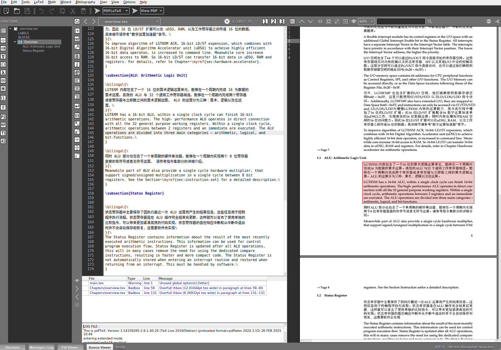

# LGT8Fx datasheet

Logic Green LGT8F328P datasheet with modern typesetting.

This is an attempt to format the datasheet in the [Technical reference
manual](https://mirror.las.iastate.edu/tex-archive/macros/latex/contrib/refman/layout_e.pdf)
theme, similar to technical manuals distributed by Adobe. It features a wide
left margin for quick handwritten calculations, as well as clear notes to the
reader.

## To contribute

One can simply download the project and edit the `Chapters/*.tex` text files
right away. To visualize the PDF datasheet in real time:

1. Download TEXMaker at https://www.xm1math.net/texmaker/ ;
2. Clone this project to the local folder;
3. Open `main.tex` in TEXMaker
4. Click `Option` > `Select this document as Master document`;
5. Start editing right away.

After making changes, submit a Github pull request to update the project.



## Adding figures

The figures are in low resolution because the source file `original/*.pdf` is
already rasterized by a 3rd party language translation program. The JPG/PNGs are
extracted from the PDF via the following command:

```bash
sudo apt install poppler-utils

pdfimages -j original/LGT8FX8P_databook_v1.0.5-English.pdf Images/f
mogrify -format png Images/*.ppm
```

For high-resolution figures, refer to the work at https://github.com/Upcycle-Electronics/LGT8Fx-Datasheet

## Related work

### Typesetting themes

* https://github.com/PetteriAimonen/latex-datasheet-template/blob/main/example.pdf
* https://github.com/smartfpga/Latex-Datasheet-Template/blob/main/userguide.pdf
* Linear-technology theme https://github.com/TinyTapeout/tt_docs/issues/4

### Simular attempts to rewrite the LGT8Fx datasheet

* https://github.com/dbuezas/lgt8fx/tree/master/docs
* https://makerhero.com/img/files/download/LGT8F328P-Datasheet.pdf?srsltid=AfmBOooEJpO_v5Rtk7VaGbKlT3lHxnSUVzyQIWEAJO7soBr1xGqSGBGf
* https://github.com/Upcycle-Electronics/LGT8Fx-Datasheet/blob/master/finalpdf/LGT8FX8P-V1.0.4J_alpha_1-22i.pdf